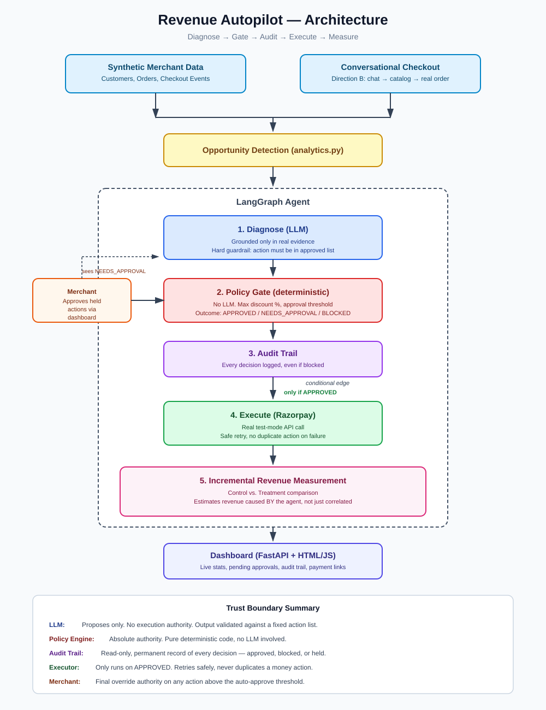

# Revenue Autopilot

**An agentic revenue-growth system for Razorpay merchants — built for the Razorpay AI Buildathon, Track 1: AI Growth & Agentic Commerce.**

🔗 **Merchant dashboard (live demo):** https://revenue-autopilot.onrender.com
🛍️ **Customer shopping experience (live demo):** https://revenue-autopilot.onrender.com/customer.html
*(Free-tier hosting — may take 30-60 seconds to wake up on first load.)*

---

## What It Solves

Merchants lose revenue in ways that are invisible or hard to act on: abandoned checkouts, missed cross-sells, hesitant high-intent customers who never convert. Existing tools either just *report* this ("sales dropped 12%") or blindly automate it (spam every customer with a discount) — neither is trustworthy for real money decisions.

**Revenue Autopilot** is an AI agent that:
1. Detects a specific revenue-loss moment (an abandoned checkout)
2. Diagnoses the likely cause, grounded only in real customer/order data
3. Proposes the best intervention (reminder, discount, or cross-sell)
4. Checks that decision against hard-coded merchant limits (bounded + gated)
5. Executes it via real Razorpay test-mode APIs
6. Measures whether the intervention **actually caused** additional revenue — not just correlated with it — using a control/treatment comparison

The core differentiator: we don't just report that revenue went up. We estimate the revenue *the agent itself caused*, distinct from revenue that would have happened anyway.

---

## Use Cases

- **Merchant reviewing today's lost revenue** — opens the dashboard, sees every abandoned checkout diagnosed in plain language, with an estimate of what's recoverable.
- **Low-risk recovery, fully automated** — a small, low-value abandoned cart gets a discount or reminder sent automatically, within merchant-defined limits, no human needed.
- **High-value recovery, human-in-the-loop** — a large order gets held for explicit merchant approval before any money-related action happens, with the AI's full reasoning visible before the merchant decides.
- **Conversational commerce** — a customer describes what they want in plain language, gets a real product recommendation, and can check out directly — this is the same "agent-readable catalog / conversational checkout" capability the track calls out, feeding into the exact same recovery engine if the customer doesn't complete payment.
- **Proving ROI, not just activity** — a merchant (or evaluator) can see not just "we sent 40 discounts" but "these discounts caused an estimated ₹X in revenue that would not have happened otherwise."

---

## How It Works, Step by Step

1. **An order is abandoned** — a customer added items to cart, started checkout, but didn't pay (from either our synthetic merchant data or a real live conversational purchase).
2. **Evidence is gathered** — order value, cart contents, checkout stage reached, and the customer's purchase history are pulled directly from the database into a structured bundle.
3. **The LLM diagnoses the opportunity** — given *only* that evidence bundle, it explains why the customer likely abandoned and proposes 1-2 candidate actions from a fixed list (`reminder`, `discount`, `cross_sell`).
4. **The policy engine checks the proposal** — plain, deterministic Python (no LLM) checks the proposed action against hard-coded merchant rules: max discount %, and an order-value threshold above which auto-execution isn't allowed.
5. **The decision is logged** — every diagnosis, every candidate action considered, the final decision, and the reason, are written to a permanent audit trail — even if the action is blocked or held.
6. **Execution (if approved)** — a real Razorpay test-mode payment link is generated for the discounted/reminder amount, with safe retry handling if the call fails, and no duplicate action ever created.
7. **If held for approval** — the order sits in the merchant dashboard's pending queue, full diagnosis visible, until a human clicks Approve — at which point it's executed the same way.
8. **Impact is measured** — separately, across a large sample of abandoned orders, we compare outcomes between customers who received an intervention and a held-back control group, to estimate revenue actually caused by the agent (see the math below).

---

## The Math: Measuring Incremental Revenue

This is the project's central differentiator, so it's worth explaining precisely rather than just asserting a number.

**The problem with a naive measurement:** if we send 100 customers a discount and 20 of them complete their purchase, it's tempting to say "the agent generated 20 sales." But some of those 20 might have completed the purchase anyway, discount or not — we don't know how many unless we compare against something.

**The method — control vs. treatment:**
1. Every abandoned order is randomly assigned, 50/50, to either a **treatment** group (the agent may act on them) or a **control** group (deliberately left untouched, purely to observe the baseline).
2. For treatment orders that receive a real, executed intervention, we track whether they convert.
3. For control orders, nothing happens — their conversion rate serves as the baseline for "what would happen with no intervention at all."

**The calculation:**
treated_conversion_rate = treated_converted / treated_total
control_conversion_rate = control_converted / control_total

incremental_lift = treated_conversion_rate - control_conversion_rate

estimated_incremental_revenue =
(incremental_lift) × (number of treated orders) × (average order value)


**A concrete example:**
- Treatment group: 100 abandoned-checkout customers get a discount → 14 complete their purchase (14%)
- Control group: 100 similar customers get nothing → 10 complete their purchase anyway (10%)
- **Incremental lift = 14% − 10% = 4 percentage points** — only this 4% is attributable to the agent, not the full 14%

**Two things stated honestly about this methodology, not hidden:**
- Since we don't have real customers responding to real discounts at scale within a hackathon timeframe, whether a treated order "converts" is modeled using a stated, code-visible assumption (`SIMULATED_RECOVERY_RATES` — e.g. a discount is assumed to recover ~30% of treated customers, a reminder ~15%) — **not observed real behavior**. This is disclosed directly in the code and in the dashboard's underlying data, not obscured.
- The control group's conversion rate is fixed at 0% by design in this MVP (nothing acts on them, so nothing converts them) — a fuller production experiment would also model organic, unprompted return behavior in the control group, rather than assuming it's exactly zero.

The point of building this the "correct" way — even with a simulated component — is that the *methodology* is real and sound; only the specific recovery-rate assumption is synthetic, and that's the honest, statistically-literate way to build this feature within the time available.

---

## Architecture



A second entry point — **conversational checkout** (Direction B: agent-to-agent/AI-buyer commerce) — lets a customer describe what they want in natural language, get a recommendation from the real product catalog, and attempt checkout. If that checkout is abandoned, it flows into the **exact same agent loop** above, with zero additional logic — proving both track directions are one connected system, not two demos glued together.

---

## Trust Boundary Matrix

Every component in this system has a clearly scoped, limited authority — no single part (especially the LLM) can act alone on money.

| Component | Role | Execution Authority |
|---|---|---|
| **LLM (diagnosis agent)** | Diagnoses the opportunity, proposes candidate actions | **None.** Can only choose from a fixed, code-enforced list of approved actions (`reminder`, `discount`, `cross_sell`) — any other suggestion is rejected before it's ever used. |
| **Policy Engine** | Decides if/how an action executes | **Absolute.** Deterministic Python, no LLM involved. Enforces max discount %, order-value approval thresholds. Every decision returns a human-readable reason. |
| **Audit Trail** | Persistent record of every decision | **Read-only, permanent.** Every diagnosis, policy decision, and outcome is logged — including actions that were blocked or held for approval. |
| **Executor** | Physically calls Razorpay | **Gated.** Only runs if the Policy Engine marked an action `APPROVED`. Retries safely on failure, never creates duplicate payment actions. |
| **Merchant (human)** | Approves higher-value actions | **Override authority.** Any action above the auto-approve threshold is held until a human explicitly approves it via the dashboard. |

---

## Guardrails

Two layers, deliberately kept separate:

- **Soft guardrail (prompt-level):** the LLM is explicitly instructed to choose only from `reminder`, `discount`, `cross_sell`, and to never invent numbers or facts beyond the evidence it's given.
- **Hard guardrail (code-level):** after every LLM response, the chosen action is validated in Python against the same approved list. Anything outside it is rejected and logged — the LLM's compliance is never assumed, only the code's enforcement is trusted. This caught real out-of-scope suggestions ("Free Shipping," "Cart Recovery Email") during development.

The same discipline applies to money: numbers used in policy checks (discount %, order value, thresholds) always come from the database or hard-coded merchant policy — never from LLM output.

---

## How We Know It's Not Hallucinating

- **Structured output only:** the LLM is required to return JSON in a fixed shape, not free text — this alone rules out most silent drift.
- **Every diagnosis is grounded in a specific, database-sourced evidence bundle** (customer history, order value, cart contents, checkout stage) passed directly into the prompt — the LLM is instructed to reason only from this, never outside it.
- **Post-hoc validation, not trust:** every returned action is checked in code against the approved action list before it can proceed to the policy gate. Invalid actions are rejected and logged, never silently used.
- **Money math is never LLM-generated:** discount amounts, policy thresholds, and incremental revenue calculations are all deterministic Python — the LLM never computes or states a financial figure that gets acted on directly.
- **Known gap, stated honestly:** free-text reasoning (the `diagnosis` field) is not fact-checked line-by-line — during testing we caught one instance where the model mentioned "shipping cost," a detail not present in the evidence. This shows our guardrails constrain *actions*, not every sentence of *explanation* — a real limitation worth continued work, not hidden.

---

## Tech Stack

- **Backend:** Python, FastAPI
- **Agent orchestration:** LangGraph (explicit `StateGraph`)
- **LLM:** Groq (`openai/gpt-oss-20b`)
- **Database:** PostgreSQL in production (Render), SQLite for local development — same models work with both via a single environment-variable-driven connection string
- **Payments:** Razorpay Python SDK, test mode
- **Email:** Resend (HTTPS-based API — chosen specifically because Render's free tier blocks traditional SMTP ports)
- **Frontend:** Plain HTML/JS dashboard and customer chat (no framework)
- **Deployment:** Render (free tier)

Deliberately not used: Redis, a vector DB/RAG, fine-tuning, a frontend framework — none were needed for this scope, and adding them would have been unjustified complexity.

---

## What Broke, and How We Got Out

Real issues hit during development, kept honest rather than polished away:

- **Razorpay test-mode has a hard cap of 30 payment links per business account** (undocumented until we hit it during batch testing). Fixed by adding a `dry_run` mode — batch/demo runs simulate execution and log it as clearly labeled "DRY RUN," never disguised as real.
- **Groq's per-minute and per-day token rate limits** were both exceeded at different points during testing. Our existing retry/failure-handling logic caught every failure cleanly (no crash), and we added longer backoff specifically for rate-limit errors.
- **A duplicate route definition** silently caused `dry_run=true` requests to hit the old, unguarded code path — no error was raised, it just silently made real API calls. Found by checking terminal logs for unexpected Razorpay retries, not by any crash. Fixed by removing the duplicate and verifying only one route definition existed.
- **A double-simulation bug** in our incremental-revenue measurement: unconverted orders weren't marked as "already simulated," so re-running the simulation re-rolled them, inflating the apparent conversion rate (44% vs. the honest ~23.5%). Fixed by giving every order exactly one permanent, non-reversible simulated outcome.
- **SQLite on Render's free tier is fully ephemeral** — the database was wiped on every redeploy and even on service restarts, forcing a manual reseed before every demo. Fixed by migrating to Render's free PostgreSQL for the deployed environment, while keeping SQLite for local development via a single environment-variable-driven connection string in `database.py` — no other code changed, since SQLAlchemy's ORM is database-agnostic. Confirmed the fix by triggering a full redeploy and verifying data survived without re-seeding.

Full details of each issue, and the reasoning behind every design decision, are in [`LEARNING.md`](./LEARNING.md).

---

## Known Limitations (stated honestly)

- Customer response to interventions (discount/reminder recovery) is a **modeling assumption**, not observed real behavior — clearly labeled as such in code and data (`SIMULATED_RECOVERY_RATES`).
- The control group's conversion rate is fixed at 0% by design (nothing acts on them) — a real production experiment would also model organic return behavior in the control group.
- No payment webhook is implemented — the system does not automatically detect when a real customer completes payment on a generated link; this is demonstrated directly rather than auto-detected, and would be a natural next step for production.

---

## Running Locally

*(Local development uses SQLite automatically — no extra setup needed. The deployed version uses PostgreSQL for persistence.)*

```bash
git clone https://github.com/sumit2000-deltech/revenue-autopilot.git
cd revenue-autopilot
python -m venv venv
venv\Scripts\activate        # Windows
pip install -r requirements.txt
```

Create a `.env` file (see `.env.example`) with:
GROQ_API_KEY=your_key
RAZORPAY_KEY_ID=your_test_key
RAZORPAY_KEY_SECRET=your_test_secret
RESEND_API_KEY=your_resend_key


Seed the database and run the agent pipeline:
```bash
python -c "from app.data.database import Base, engine; from app.data import models; Base.metadata.create_all(bind=engine)"
python -m app.data.seed
python -c "from app.data.analytics import assign_experiment_groups; assign_experiment_groups()"
python -m app.agent.batch_runner
python -c "from app.data.analytics import simulate_treatment_outcomes; simulate_treatment_outcomes()"
```

Start the app:
```bash
uvicorn app.main:app --reload
```
Visit `http://127.0.0.1:8000` (merchant dashboard) and `http://127.0.0.1:8000/customer.html` (customer shopping experience).

---

## Project Structure
app/
├── main.py # FastAPI entrypoint
├── data/ # Models, synthetic data generation, analytics
├── agent/ # LangGraph agent, diagnosis, executor, batch runner, conversational checkout
├── policy/ # Deterministic policy/gating engine
├── integrations/razorpay/ # Razorpay API client
├── integrations/email/ # Resend email client
├── audit/ # Audit trail logging
└── api/ # FastAPI routes (dashboard, customer chat, admin)
frontend/ # Dashboard + customer chat (plain HTML/JS)
docs/ # Architecture diagram